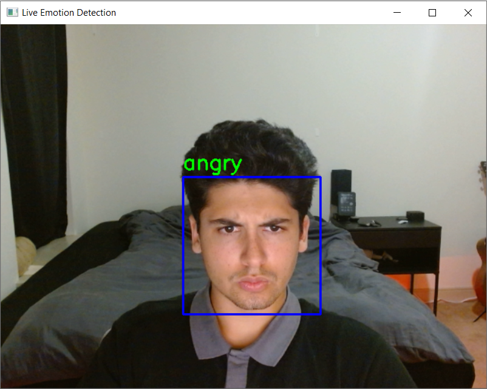
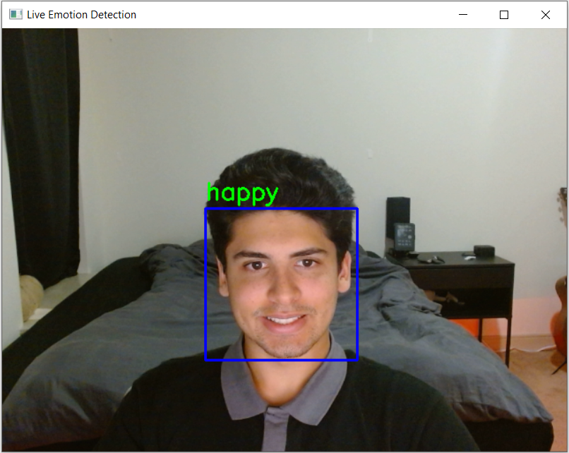
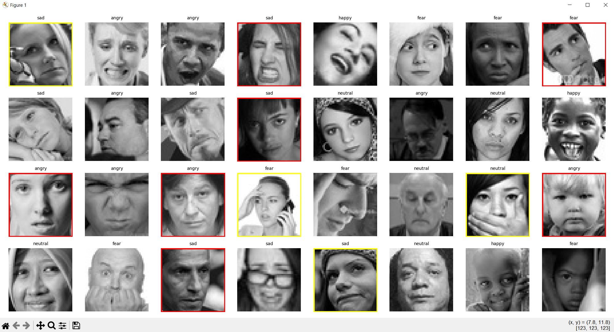

# ml-emotion-detector

**ml-emotion-detector** is a real-time facial emotion recognition system built using PyTorch, OpenCV, and a ResNet-based convolutional neural network. It classifies facial expressions from webcam video into emotion categories such as angry, happy, sad, neutral, and surprise.

## Features

- Real-time facial emotion detection using webcam.
- Trained on the [FER2013 dataset](https://www.kaggle.com/datasets/msambare/fer2013).
- ResNet-18 architecture tuned for grayscale emotion classification.
- Detects faces using OpenCV’s Haar Cascade classifier.
- Displays emotion labels on webcam video feed with bounding boxes.
- Automatic class name detection from dataset folder structure.

## Screenshots
<div align="center">
    &nbsp;&nbsp;&nbsp;&nbsp;&nbsp;
    
</div>

## Training parameters
- **Input size:** 224×224
- **Batch size:** 32
- **Epochs:** 10
- **Learning rate:** 0.001
- **Optimizer:** Adam
- **Loss function:** CrossEntropyLoss


## Project Structure

```
ml-emotion-detector/
├── model.py               # Defines the custom ResNet model
├── train.py               # Model training logic
├── main_train.py          # Entry point for training
├── run_inference.py       # Real-time webcam inference
├── inference.py           # Webcam loop and model loader
├── data_loader.py         # Data loading and transformation
├── evaluate.py            # Model evaluation
├── image_capture.py       # Optional: capture your own dataset images
├── my_data/               # FER2013 dataset in folder format
│   ├── train/
│   │   ├── angry/
│   │   ├── happy/
│   │   └── ...
│   └── val/
│       ├── angry/
│       ├── happy/
│       └── ...
│── trained_model.pth      # Saved model weights after training
└── plot_image_batch.py    # Plots your data and compares with label.
```

## Installation

1. **Clone the repository**
```bash
git clone https://github.com/your-username/ml-emotion-detector.git
cd ml-emotion-detector
```

2. **Install dependencies**
```bash
pip install -r requirements.txt
```

3. **Download and prepare the dataset**

Download the FER2013 dataset from Kaggle and convert it to folder format (each class in its own subdirectory). Organize it as:

```
my_data/
├── train/
│   ├── angry/
│   ├── happy/
│   └── ...
└── val/
    ├── angry/
    ├── happy/
    └── ...
```

4. **Train the model**
```bash
python main_train.py
```

5. **Run emotion detection using your webcam**
```bash
python run_inference.py
```

## Requirements

- Python 3.10+
- PyTorch
- torchvision
- OpenCV
- scikit-learn
- matplotlib (optional for visualization)

## Tips

- You can modify number of epochs, learning rate, and batch size in `main_train.py`.
- Ensure webcam lighting is good for best real-time results.
- If using a GPU, CUDA will be automatically used during training and inference.

## Troubleshooting

- **Mismatch in output size**: Make sure your model was trained with the same number of emotion classes you are using during inference.
- **Model loads but predictions are inaccurate**: Retrain using more balanced or cleaned datasets. FER2013 can be noisy.

## Future work
- Improve label quality in the training set:
    - 7 images in a sample batch were mislabelled (red boxes)
    - 4 images were questionable (yellow boxes)
    - Label noise confuses the model during training
    - Reduces accuracy and increases misclassification
    - Better labels = better performance
    - Bellow is a small sample of the training data.

<div align="center">
    
</div>


## License

This project is licensed under the MIT License. See the `LICENSE` file for details.

## Acknowledgments

- FER2013 Dataset by Kaggle
- PyTorch and torchvision teams
- OpenCV contributors